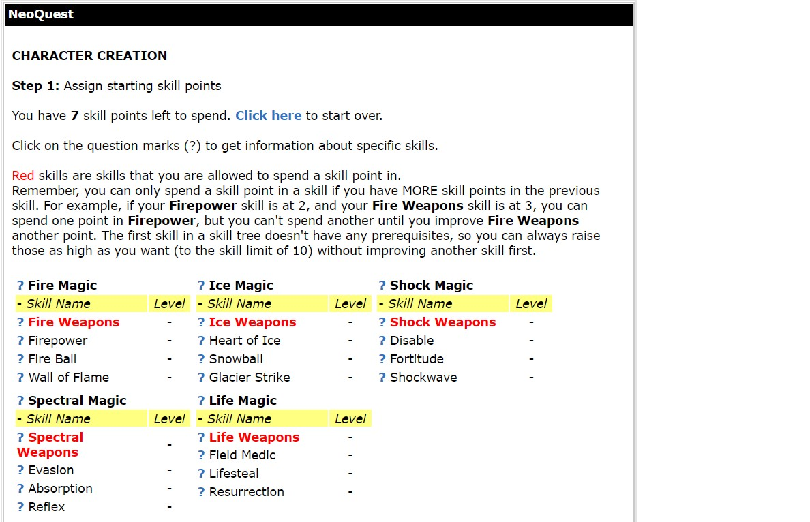
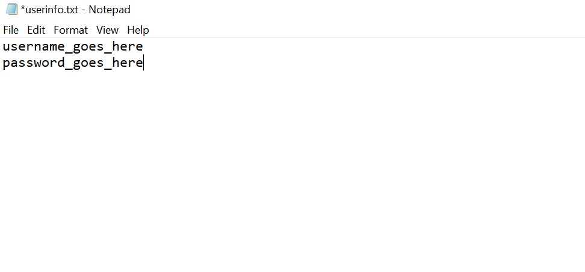
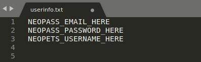
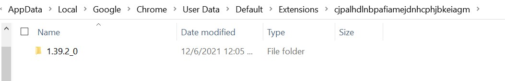
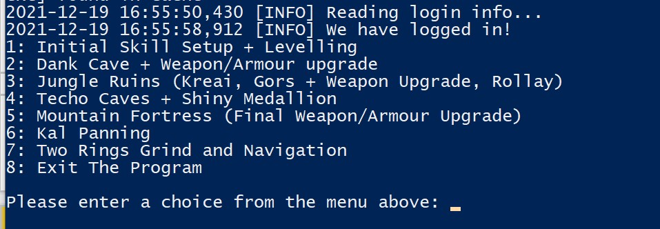
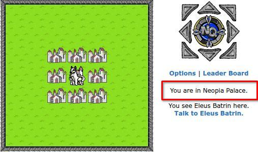
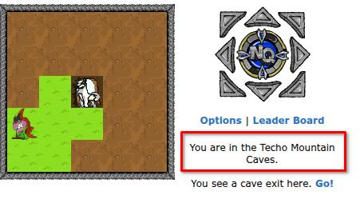

# Neoquest Auto - A (Mostly) Automated Neoquest Player

Neoquest Auto is a simple-to-use program built with Python and Selenium that helps users to easily
complete the game and get the game trophies by automating the majority of gameplay including map movement, grinding,
and weapon upgrades, taking the player all the way from the starting square to the final bosses.
It follows a predefined completion strategy that has been tested and modified over multiple runs
(not tested on InSaNe mode).
The only user interaction required is choosing the corresponding program option to complete
each part of the game.

~~**2024/04/27 update:** I am not sure when it started, but Neopets has an incredibly annoying sitewide page hiccup that sometimes occurs when performing an action.
This not only causes page loads to fail in battle, but also causes movement actions to be unpredictably duplicated.
Unfortunately, this means that **path following/navigation with this program is not reliable right now**, though autobattle/training still handles page load failures properly.~~

2025/04/27 update: Exactly one year from last update, we have updated the movement method and
allowed use of Neopass. Only, now I can no longer test the traditional login method anymore.
Hopefully it works. Anyway, make sure to [provide the correct login information](#login-with-neopass) and [use the correct command line flag](#starting-the-program)

As of now, the program does not keep track of game state on exit.
This may change in the future, but make sure you can run each function to completion before starting.

### Prerequisites

Python 3 or higher - [You can get it from here](https://www.python.org/downloads/)

Google Chrome Browser - [You can get it from here](https://www.google.com/intl/en_ca/chrome/)

~~Adblock for Chrome - [You can get it from here](https://chrome.google.com/webstore/detail/adblock-%E2%80%94-best-ad-blocker/gighmmpiobklfepjocnamgkkbiglidom)~~

uBlock Origin Lite for Chrome - [You can get it from here](https://chromewebstore.google.com/detail/ublock-origin-lite/ddkjiahejlhfcafbddmgiahcphecmpfh)

~~This program has only been tested for Windows.~~
This program has been tested on Windows, Linux, and MacOS, and the only difference you should
experience is how you call Python from the terminal.

### Installing

to prepare the program's starting point, login to Neopets and start a new Neoquest game. Once you see the following
page, you are finished:



After making a copy of this repository, open the folder in the terminal of your choice and create and activate your
virtual environment (venv).

[Your virtual environment creation instructions](https://docs.python.org/3/library/venv.html) will differ based on
what terminal you use.

For example, Windows users using Powershell might perform the following commands:

```
py -m venv venv

venv/Scripts/Activate.ps1
```

Linux and Mac users will probably want to use this syntax:

```
python3 -m venv venv

source venv/bin/activate
```

Once your venv is activated, use the following command to install the necessary requirements to
your venv:

```
pip install -r requirements.txt
```

The program is almost ready to run. There are two text files in the src/txtfiles folder named userinfo.txt and
adblockpath.txt.

**The information that you input to userinfo.txt differs depending on which login method you are
using.**

Make sure to enter the required information on separate lines in the correct order.

### Login With Traditional Login

In userinfo.txt, enter your Neopets username on the first line of the file,
and your password on the second line.



### Login With Neopass

Neopass login requires your Neopass email, password, and finally your account username in that
order. It should look something like this:



The program can run without adblock enabled, but it will run slowly.
For now, [consult this thread](https://www.reddit.com/r/learnpython/comments/4zzn69/how_do_i_get_adblockplus_to_work_with_selenium/)
for instructions on how to find the path to your adblock extension folder.
Copy this folder path into adblockpath.txt.
Below is an example of what the folder path could look like for a windows user:



Note: I have tried implementing an "Eager" pageLoadStrategy for the Selenium WebDriver,
and while it does speed up the program, it is still far slower than blocking ads altogether.

Now, navigate to the src directory and run autoplayerlauncher.py to start the program:

### Starting the Program

With traditional login:

```
cd src
py ./autoplayerlauncher.py
```

With Neopass login:

```
cd src
py ./autoplayerlauncher.py --use-neopass
```

The program should now launch and present you the following interface:



At this point, simply make sure you are on the skill screen and enter 1 in the program.
Below is a list of very rough completion times one can expect for each function:

Option 1: 20~ minutes

Option 2: 50~ minutes

Option 3: 3~ hours

Option 4: 3~ hours

Option 5: 1 hour 40~ minutes

Option 6: 55 minutes

Option 7 (end of game): 1 hour 20~ minutes

### Troubleshooting

**I got a warning about Google detecting suspicious login activity and can't login!**

I find that this happens if you normally use another browser for Neopets, and then the program
suddenly logs you in with Chrome. You generally do not need to be worried about this. After all,
normal players also switch browsers from time to time.

**Solution:** As the warning says, simply wait for some time (e.g. 10 minutes) and try to run the program again.
They can't block you from logging in forever, right?

**The browser closed itself before it could finish the login process**

This happens when the login process takes too long and the authenticated page doesn't load.

**Solution:** Running the program again should work if it was just a random issue.

**The program is out of sync with the actual map location and is no longer taking me to the right
location**

This doesn't happen often, but I'm sure that it is annoying when it does. Unfortunately, I don't
have an easy fix for this right now. If you do, I'd gladly accept a PR!

**Solution:** Determine the autoplayer option that you were in the middle of running. Navigate back
to the correct starting tile manually and rerun the option. The starting tiles are shown below:

### Starting Tile For Options 1 (Initial Skill Setup), 2 (Dank Cave), 3 (Jungle Ruins), and Returning to Jahbal After Dying



You should be very familiar with this location. It is the home of many early game upgrades.

### Starting Tile For Option 4 (Techo Caves)



If you get lost in the caves, I'm sorry but you will likely have a hard time getting out unless you
already know the game well. Consult maps to identify which cave you are in and how to get back to
the first cave's starting tile.

~[MountainFortressEntranceTile](readmeresources/StartingTileImages/mountain_fortress_start_tile.jpg)

The Mountain Fortress is connected to Techo Cave 6 if you are following the IDNQ map.

~[KalPanningStartTile](readmeresources/StartingTileImages/kal_panning_start_tile.jpg)

The Kal Panning route starts directly outside the Mountain Fortress.

~[TwoRingsStartTile](readmeresources/StartingTileImages/two_rings_grind_start_tile.jpg)

Similarly, the Two Rings route starts directly from where you beat Faleinn.

## Built With

- [Python](https://www.python.org) - The programming language used
- [Selenium](https://www.selenium.dev) - Used for automating browser navigation
